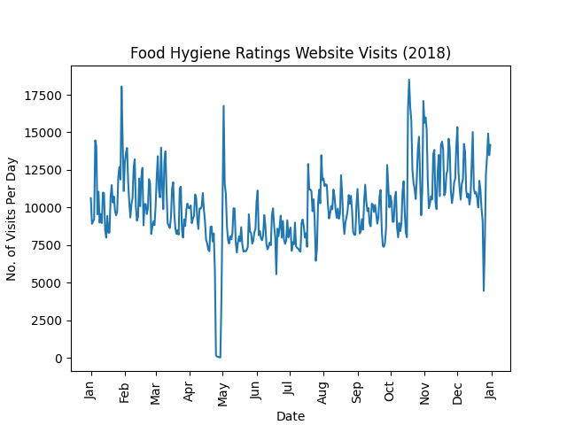

# Government-Data-Analysis
Analysing Government Data using Python.

## Food Hygiene Webiste Visits (2018)
(Data from https://data.gov.uk/dataset/3e358499-eb65-4dde-9b08-9de6cac52efb/food-hygiene-ratings-website-traffic )
Using Python and matplotlib to import the CSV data, manipulate it and plot it. Also obtained basic summary statistics from the data.

#### Figure 1: The plot created from this dataset, showing the amount of page views for the Food Hygiene website each day in 2018.

Minimum Value:  24 visits on Sun 29 Apr.
Maximum Value:  18506 visits on Thu 18 Oct.
Mean Value:  10025 visits.
Correlation between page visits, unique visitors and page views:
|               |   Visits | Unique Visitors | Page Views
|           ----|----------|----------------|----------
|Visits         | 1.000000    |    0.998224  | 0.942556
|Unique Visitors |  0.998224   |     1.000000 |  0.938373
|Page Views      | 0.942556    |    0.938373  | 1.000000

|Shows very high correlation between each variable.

